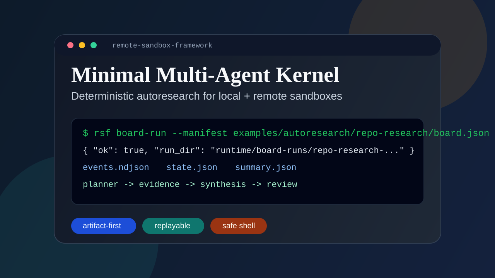

# Remote Sandbox Framework

Most agent frameworks optimize for capability demos. This one optimizes for execution you can replay, audit, and trust.

Minimal autoresearch multi-agent kernel for deterministic execution.

`remote-sandbox-framework` is a small, auditable runtime for agent collaboration where:

- agents propose and inspect
- artifacts are the handoff surface
- execution is deterministic
- remote shell access stays bounded
- observability is written to files you can replay

It does not try to be a full agent platform. It is intentionally small.



## GitHub Setup

Suggested GitHub homepage settings are bundled in [docs/github-homepage.md](docs/github-homepage.md).

- About description: `Minimal autoresearch multi-agent kernel for deterministic, artifact-first execution on local or remote sandboxes.`
- Social preview source: [docs/assets/hero-terminal.svg](docs/assets/hero-terminal.svg)
- Suggested topics: `ai-agents`, `multi-agent`, `autoresearch`, `agent-framework`, `deterministic`, `artifact-first`, `remote-execution`

## Why This Exists

Many agent stacks feel powerful in demos but painful in day-to-day use:

- state is hard to resume
- task execution is difficult to replay
- tool use can become opaque
- costs are easy to lose track of
- remote execution boundaries are often too loose

This project focuses on the opposite tradeoff:

- deterministic task manifests
- file-based completion checks
- append-only event logs
- local or remote shell runners
- optional OpenAI-compatible models used as proposers, not unrestricted operators

## What You Can Build

- repo research boards that inspect a codebase and write a report
- remote experiment queues with CPU/GPU slot control
- safe model-assisted planning where humans still control execution
- lightweight `planner -> evidence -> synthesis -> review` pipelines

## Quickstart

Install locally:

```bash
pip install -e .
```

Run the flagship demo:

```bash
rsf board-run --manifest examples/autoresearch/repo-research/board.json
```

Expected demo shape:

```text
planner -> evidence -> synthesis -> review
events.ndjson + state.json + summary.json
```

Inspect the latest run:

```bash
rsf board-status --run-dir runtime/board-runs/repo-research-YYYYMMDD-HHMMSS
rsf board-replay --run-dir runtime/board-runs/repo-research-YYYYMMDD-HHMMSS
```

The repo-research demo works without an LLM. If you do provide an OpenAI-compatible endpoint, the planning and synthesis tasks will use it.

```bash
rsf board-run \
  --manifest examples/autoresearch/repo-research/board.json \
  --base-url https://api.openai.com \
  --api-key "$OPENAI_API_KEY" \
  --model gpt-4o-mini
```

## Board Workflows

Phase 1 introduces an additive board manifest for artifact-first collaboration:

- `kind: "board"`
- `version: 2`
- `artifacts[]`: named outputs with stable paths
- `tasks[]`: a DAG of workers producing and consuming artifacts
- fixed task modes: `llm_propose`, `shell_stage`, `synthesis`, `review_gate`

Each run writes:

- `events.ndjson`: append-only event ledger
- `state.json`: latest materialized run state
- `summary.json`: final run summary
- `artifacts/`: stable outputs produced by the workflow

### Board CLI

```bash
rsf board-run --manifest examples/autoresearch/repo-research/board.json
rsf board-status --run-dir runtime/board-runs/<run_id>
rsf board-replay --run-dir runtime/board-runs/<run_id>
rsf board-init --preset repo-research --dest ./my-board
```

### Repo Research Demo

The demo in [examples/autoresearch/repo-research/README.md](examples/autoresearch/repo-research/README.md) runs this flow:

1. `repo_scan` builds a compact repository index.
2. `planner` turns that index into a brief.
3. `evidence_extract` creates structured evidence JSON.
4. `synthesis` writes a shareable report.
5. `review` verifies the final report contains required signals.

Outputs are deterministic and local:

- `examples/autoresearch/repo-research/runtime/artifacts/repo-index.md`
- `examples/autoresearch/repo-research/runtime/artifacts/evidence.json`
- `examples/autoresearch/repo-research/runtime/artifacts/report.md`

## Existing Remote Runtime

The original remote sandbox runtime remains intact.

It still provides:

- a lightweight FastAPI sidecar on the remote host
- local CLI / HTTP control of remote jobs
- stdout/stderr inspection
- lease time and cost tracking
- idle shutdown control
- deterministic manifest scheduling for staged CPU/GPU work

Common commands:

```bash
rsf health
rsf status
rsf run --cwd /root/workspace --command "python train.py" --watch
rsf logs <job_id> --stream stdout --raw
rsf cancel <job_id>
rsf arm-shutdown 600
rsf manifest-reconcile --manifest examples/manifest.local.json
rsf manifest-schedule --manifest examples/manifest.local.json --queue-log runtime/scheduler.log --runs-dir runtime/runs
```

## Remote Runners And Presets

### Remote deployment

On a remote Linux machine:

```bash
git clone https://github.com/dogeee-debug/remote-sandbox-framework.git
cd remote-sandbox-framework
cp .env.example .env
vim .env
bash scripts/start_server.sh
```

### Core environment variables

| Variable | Meaning |
| --- | --- |
| `REMOTE_SANDBOX_PROVIDER` | Provider preset, default `generic` |
| `REMOTE_SANDBOX_TOKEN` | Bearer token, required |
| `REMOTE_SANDBOX_WORKSPACE` | Allowed workspace root |
| `REMOTE_SANDBOX_RUNTIME_ROOT` | Runtime and logs root |
| `REMOTE_SANDBOX_HOURLY_RATE` | Hourly price for cost estimation |
| `REMOTE_SANDBOX_ENABLE_SHUTDOWN` | Whether shutdown is actually executed |
| `REMOTE_SANDBOX_SHUTDOWN_COMMAND` | Shutdown command |
| `REMOTE_SANDBOX_DEFAULT_TIMEOUT` | Default job timeout in seconds |

### SSH tunnel

```bash
ssh -L 8787:127.0.0.1:8787 root@YOUR_REMOTE_HOST
```

### Local environment

PowerShell:

```powershell
$env:REMOTE_SANDBOX_URL="http://127.0.0.1:8787"
$env:REMOTE_SANDBOX_TOKEN="YOUR_TOKEN"
```

Linux / macOS:

```bash
export REMOTE_SANDBOX_URL=http://127.0.0.1:8787
export REMOTE_SANDBOX_TOKEN=YOUR_TOKEN
```

### AutoDL preset

AutoDL is still supported, but it is no longer the homepage story.

See [examples/autodl/README.md](examples/autodl/README.md) for the preset-specific flow.

## Manifest Scheduler

The existing scheduler remains the deterministic execution layer for staged tasks.

Key fields:

| Field | Meaning |
| --- | --- |
| `resource_slots` | Concurrent resource slots, e.g. `{ "cpu": 2, "gpu": 1 }` |
| `runner_profiles` | Optional execution configs for `local_shell` and `ssh_shell` |
| `tasks[].smoke` | Harmless precondition check |
| `tasks[].stages[]` | Staged commands with resource slot and completion rule |
| `completion.kind=file_exists` | Recommended completion predicate for replay and reconcile |

Local dry-run:

```bash
rsf manifest-schedule \
  --manifest examples/manifest.local.json \
  --queue-log runtime/smoke/scheduler.log \
  --runs-dir runtime/smoke/runs \
  --poll-seconds 1 \
  --max-idle-polls 3
```

State reconciliation:

```bash
rsf manifest-reconcile --manifest examples/manifest.local.json
```

SSH execution:

1. Copy `examples/manifest.ssh.json`
2. Fill `host`, `user`, `port`, and remote `workdir`
3. Add file-based completion outputs for each stage
4. Start with the same `manifest-schedule` command

## Model-Assisted Planning

The framework supports any OpenAI-compatible `/v1/chat/completions` endpoint.

The intended use is proposal generation, not unrestricted shell control:

```bash
rsf assistant-propose \
  --base-url https://api.openai.com \
  --api-key "$OPENAI_API_KEY" \
  --model gpt-4o \
  --goal "Plan three reproducible seed runs for a remote GPU experiment." \
  --manifest examples/manifest.local.json \
  --constraint "Do not use destructive shell commands." \
  --constraint "Every task must have a smoke check and file completion check."
```

## HTTP API

Request header:

```text
Authorization: Bearer <REMOTE_SANDBOX_TOKEN>
```

Current job/runtime endpoints:

- `GET /health`
- `GET /status`
- `POST /jobs/run`
- `GET /jobs/{job_id}`
- `GET /jobs/{job_id}/logs`
- `POST /jobs/{job_id}/cancel`
- `POST /lease/start`
- `POST /lease/stop`
- `POST /shutdown/arm`
- `POST /shutdown/disarm`
- `POST /shutdown/now`

## Comparison

| Dimension | This project | Heavier agent stacks |
| --- | --- | --- |
| Core abstraction | Artifacts plus deterministic tasks | Conversations plus tools plus orchestration layers |
| Failure recovery | Resume from files and replay from events | Often coupled to framework-specific state |
| Execution safety | Bounded shell plus file completion checks | Often broader tool autonomy |
| Observability | `events.ndjson`, `state.json`, `summary.json` | Varies widely |
| Local onboarding | Works with deterministic fallback, no model required | Often expects full model/tool setup |
| Remote runtime | Built in | Commonly external or bolted on |
| Scope | Small kernel | General-purpose platform |
| Time to inspect a run | Minutes | Often much longer |

## Why It Can Get Stars

- Sharp scope: it is easy to understand in one screen.
- Strong contrast: it does less than bigger frameworks, but does the critical execution path more clearly.
- Shareable demo: one command produces a board run, a report, and replayable artifacts.
- Real-world hook: local plus remote execution is built in instead of treated as an afterthought.

## Development Verification

```bash
python -m compileall src
python -m unittest discover -s tests -p "test_*.py"
python -m remote_sandbox_framework.cli manifest-schedule --manifest examples/manifest.local.json --queue-log runtime/smoke/scheduler.log --runs-dir runtime/smoke/runs --poll-seconds 1 --max-idle-polls 3
python -m remote_sandbox_framework.cli board-run --manifest examples/autoresearch/repo-research/board.json
```

## Chinese Documentation

Chinese companion docs live in [README.zh-CN.md](README.zh-CN.md).
